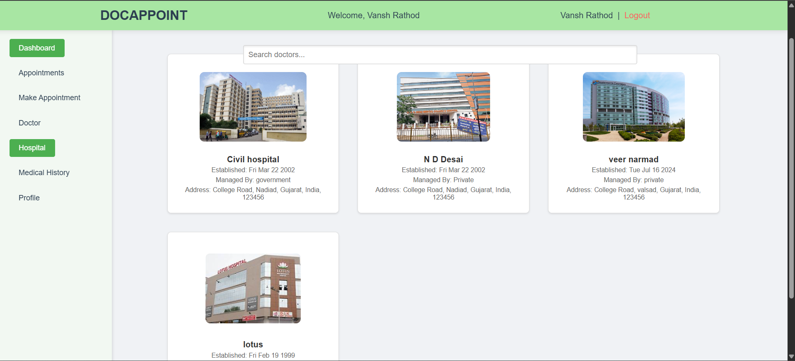
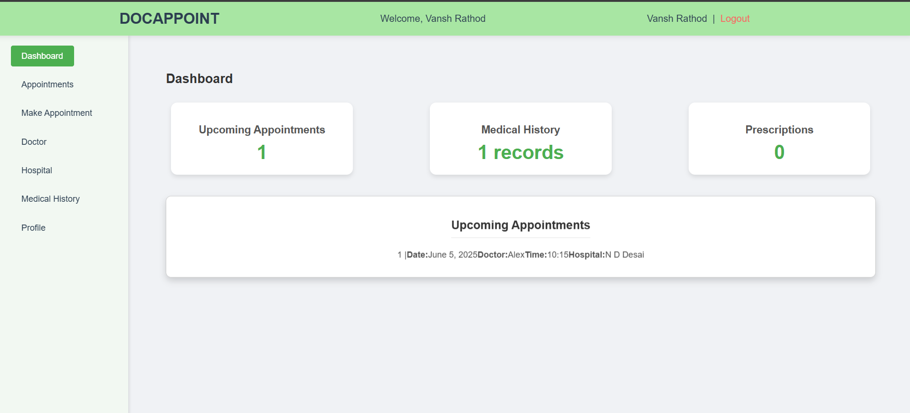
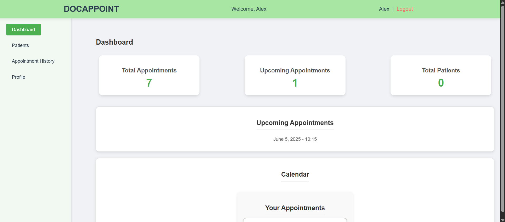
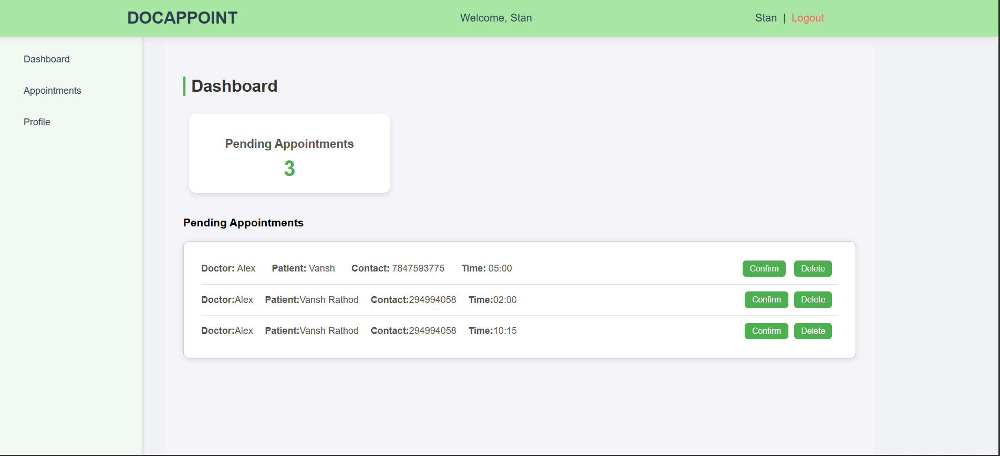
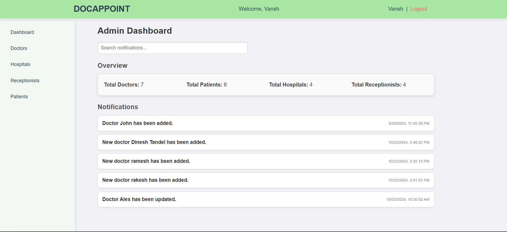

# Doctor Appointment System

Welcome to the **Doctor Appointment System**! This web-based application simplifies finding doctors, booking appointments, and managing patient healthcare records. It offers a seamless experience for patients to connect with healthcare providers and for doctors/receptionists to manage their schedules efficiently.

---

## 📸 Screenshots

Here's a glimpse of the Doctor Appointment System in action across various user interfaces:

| Hospital List | Patient Dashboard | Doctor Dashboard | Receptionist Dashboard |
| :------------------------------------------------------: | :---------------------------------------------------------: | :-------------------------------------------------------: | :---------------------------------------------------------------: |
|  |  |  |  |
| *Browse Available Hospitals* | *Patient's Personalized Overview* | *Doctor's Appointment & Patient View* | *Manage Pending Appointments* |

| Admin Dashboard |
| :-------------------------------------------------------: |
|  |
| *Overall System Management* |

---

## ✨ Project Overview

The Doctor Appointment System is designed to streamline the traditional appointment booking process. It provides a centralized platform for patients to find suitable doctors based on their needs, book appointments, and manage their health information. For healthcare providers, it offers tools to manage patient records, appointments, and receive feedback.

---

## 🚀 Key Features

This system offers a comprehensive set of functionalities for various user roles:

### 1. User Authentication
* **Secure Access:** Allows users to **register**, **log in**, and **log out** securely.
* **Profile Management:** Users can **view and update their profile information**.

### 2. Patient Registration
* **New Patient Onboarding:** Enables easy registration for new patients by collecting personal details, medical history, and contact information.

### 3. Hospital Selection
* **Location & Preference-Based Search:** Users can **choose a hospital** from a list, filtering by location or other preferences.

### 4. Doctor Discovery
* **View Available Doctors:** Displays a detailed **list of doctors** at the selected hospital, including their specialties, availability, and profiles.

### 5. Appointment Search & Booking
* **Search for Available Appointments:** Users can **search for open appointment slots** based on doctor's schedule and preferred timings.
* **Book an Appointment:** Facilitates **booking an appointment** with a chosen doctor, providing instant confirmation and appointment details.

### 6. Appointment Management
* **Flexibility for Users:** Patients can easily **manage their appointments**, including options to **cancel or reschedule** existing bookings.

### 7. Patient Feedback
* **Post Review:** Patients are empowered to **post reviews and ratings** for doctors after their appointments, offering valuable feedback.

### 8. Patient Records & Information
* **Comprehensive View:** Patients can **view their medical records**, appointment history, and personal information in one place.

### 9. Automated Reminders
* **Timely Notifications:** The system automatically **sends reminders to patients** about their upcoming appointments via email or SMS (implementation details may vary).

### 10. Doctor/Admin Appointment Overview
* **Centralized Scheduling:** Doctors and administrators can **view all appointments for a specific doctor**, including patient details and appointment times.

---

## 🛠️ Installation & Setup

Follow these steps to get the Doctor Appointment System up and running on your local machine:

```bash
# 1. Clone the repository
git clone [https://github.com/vanshh13/Doctor_Appointment_System.git](https://github.com/vanshh13/Doctor_Appointment_System.git)
cd Doctor_Appointment_System

# 2. Navigate into the backend directory and install dependencies
cd backend
npm install

# 3. Start the backend server
npm start # This will typically run on http://localhost:5000

# 5. Navigate into the frontend directory and install dependencies
cd ../frontend
npm install

# 6. Start the frontend application
npm start # This will typically run on http://localhost:3000
